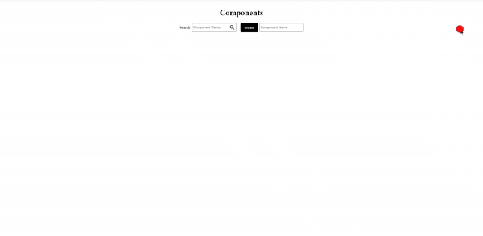

# Frontend UI Builder

- [Mithril](https://mithril.js.org/)
- [Vite](https://vitejs.dev/)
- [Material Design Icons](https://pictogrammers.github.io/@mdi/font/6.9.96/)
- [SQLite3](https://www.npmjs.com/package/sqlite3)
- [Bluebird](https://www.npmjs.com/package/bluebird)
- [Express](https://www.npmjs.com/package/express)
- [CORS](https://www.npmjs.com/package/cors)


## Download

```sh
git clone https://github.com/hlop3z/frontend-ui-builder.git
```

## Installation

```sh
./run.sh install
```

## Server (Dev.)

```sh
./run.sh
```

## Demo

